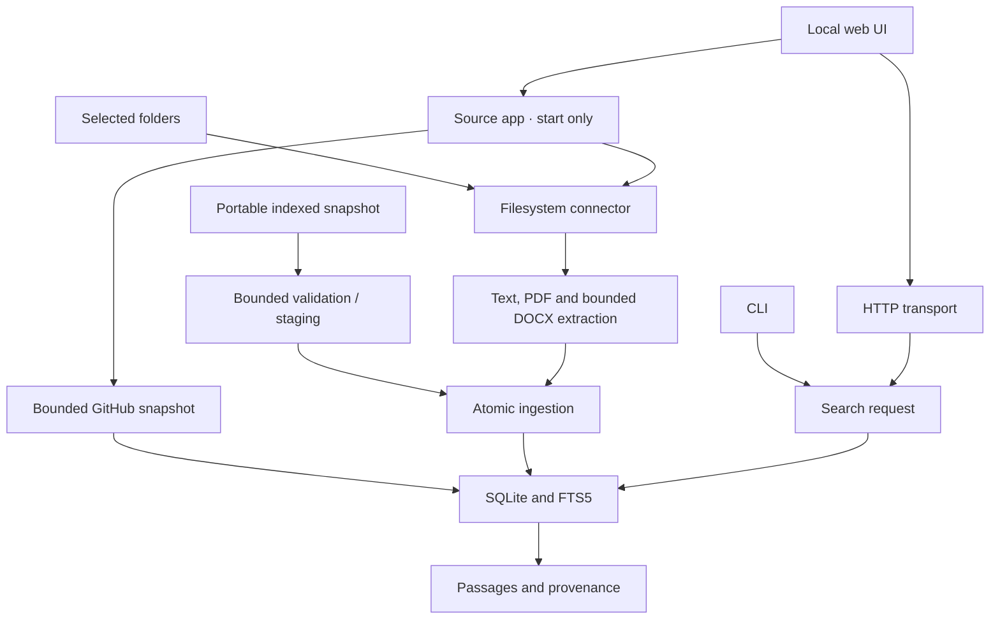

# Architecture

## Shape

Findrail starts as a modular Go application with an embedded SQLite index and
local clients. The modular boundaries are designed for a large product without
requiring separate services to run the first useful workflow.

Public GitHub files use a bounded archive prepared before the same atomic
publication boundary. Source management is writable only in `start`; `serve`,
`demo`, MCP, and the default HTTP handler remain read-only. Private adapters,
semantic retrieval, and desktop launching remain future extensions. The source
build also has a read-only stdio MCP transport over the same search and
indexed-evidence contracts.

## Boundaries

| Module | Owns | Depends on |
|---|---|---|
| `pkg/connector` | Source / document inventory contract | Go standard library |
| `internal/connectors/filesystem` | Explicit root enumeration and source identity | Connector contract, text extraction |
| `internal/connectors/github` | Public ref resolution and bounded commit archive preparation | Connector contract, text extraction, HTTP standard library |
| `internal/extract/text` | Bounded reads and UTF-8 validation | Standard library |
| `internal/extract/pdf` | Isolated PDF text worker and page attribution | PDF parser, connector contract |
| `internal/extract/docx` | Bounded offline WordprocessingML body-to-text extraction | Go ZIP/XML standard library |
| `internal/sync` | Source discovery, event debounce, retries and health | Filesystem adapter, ingest, store, fsnotify |
| `internal/sourceapp` | `start`-scoped source operations and bounded process-memory jobs | Connectors, ingest, store |
| `internal/sourcecoord` | Shared per-source scan/removal exclusion inside one process | Standard library |
| `internal/ingest` | Atomic full-source scan orchestration | Connector contract, storage interface |
| `internal/store/sqlite` | Schema, transactions, content hashes, FTS, sources | SQLite driver and domain contracts |
| `internal/search` | Retrieval request / response, literal mode and restricted Advanced parser | Standard library |
| `internal/transport/http` | Loopback HTTP, embedded UI and opt-in `start` mutation boundary | Search, source status and optional source app |
| `internal/transport/mcp` | Scoped read-only stdio MCP tools and response budgets | Search interface, read-only SQLite evidence |
| `internal/cli` | Composition, command parsing, presentation | Application modules |
| `cmd/findrail` | Process entry, signals, version | CLI |

The first transport source-status interface uses the SQLite source-status type;
move that DTO into a neutral package when a second storage adapter is justified.
Do not create a second persistence abstraction solely to hide this small seam.

## Ingestion transaction

1. Resolve and validate the selected source; generate a stable source ID.
2. Start a storage transaction and a unique scan token.
3. Enumerate documents under the source root. Extract bounded text, hash it,
   attach original URI and path, and emit normalized documents.
4. Insert new / changed documents. Unchanged text updates scan metadata without
   rewriting the FTS index.
5. After a successful complete enumeration, prune source documents not seen in
   the scan, update freshness, and commit.
6. On any enumeration / extraction / storage error or cancellation, roll back.

Every source is independent. Overlapping roots can intentionally create distinct
source entries; cross-source deduplication is a later retrieval feature.

## Identity and deletion

The filesystem source ID hashes the canonical absolute root. Document IDs hash
source ID and normalized relative path. A rename therefore creates a new document
and removes the old one after a complete scan. Content hashes detect unchanged
extracted text; PDF hashes also encode page boundaries and extraction version. Original files are never modified.

Deletion triggers update FTS in the same transaction. `forget` logically removes
a source, documents, and searchable terms. SQLite / WAL / filesystem bytes may
remain recoverable; logical deletion is not a cryptographic erasure claim.

## Retrieval

Literal mode tokenizes user input into quoted FTS terms joined with AND and
remains the default. An opt-in restricted Advanced grammar supports phrases,
OR branches, exclusions and token prefixes; shared server-side format, path and
title filters apply before count and limit. SQL parameters carry user values.
BM25 retains the title weight and deterministic document-ID tie-break. PDF
Advanced phrase evidence is page-local; preview retrieves a bounded indexed
snapshot by document ID, never an arbitrary filesystem path. See
[search query semantics](search-query.md).

Future search may add passage chunks, deduplication, language analysis, and optional semantic candidates. Store a chunk-to-document mapping and
content hash for citations; stale embeddings must never survive a document update
or source removal.

## Storage

SQLite FTS5 and a CGO-free Go driver keep installation simple. WAL and foreign
keys are enabled. Schema migrations 1–6 are transactional and embedded in the binary.
Schema 3 stores GitHub selection/snapshot metadata and stale-update revision guards;
schema 4 stores per-folder DOCX input limits (legacy default disabled) and source
registration tokens/revisions for guarded configuration and removal. Schema 5
stores immutable archive-source provenance and original content hashes separately
from imported destination hashes. Archive sources never enter filesystem or
GitHub discovery; import publishes the source and all searchable content in one
transaction.
Schema 6 stores one bounded last-successful indexing report per source. It is
published with source content and pruning in the same transaction; live attempts
remain process-local.
Unknown newer schemas are rejected. A one-connection writer pool serializes
updates; four query-only read connections use WAL snapshots, preserving search
availability during extraction. PDF pages and their FTS entries commit in the
same transaction as document updates. See [alpha semantics](local-alpha.md).

Content is stored locally as plaintext. The default directory is private when
newly created; existing directory permissions are not rewritten. Disk encryption
remains the user's operating-system responsibility until a separately designed
encrypted storage mode exists.

## Source sandbox

Folder roots are explicitly chosen. Symlinks and hidden entries are skipped.
`os.OpenRoot` confines file opening to the chosen root. Size and UTF-8 limits apply
before indexing. Source code and HTML are treated as text. Known credential-like
filenames are filtered, but arbitrary embedded secrets cannot be reliably
recognized by this baseline policy.

## Transports and clients

The current server binds only to a loopback address and retains Host checks. The
read-only `serve` API and demo remain unchanged; only `start` opts into management
routes. Mutations require an exact Origin for the actual bound authority, a
random process-scoped token in a custom header, and non-cross-site Fetch Metadata.
JSON is strict and size limited; session responses are no-store. The capability
is not persisted and is not protection from another process running as the same
OS user. Indexed text enters the UI through `textContent`, not HTML insertion.

Remote serving requires an explicit authentication design, authorization, TLS,
and operational documentation. Changing the default bind address is not that
design. The implemented MCP transport is local stdio only: it exposes
read-only search and evidence retrieval with fixed source scopes and bounded
responses; it does not provide a remote endpoint.

## Growth path

| Milestone | Additions |
|---|---|
| Local alpha (implemented) | PDF text, file watching, evidence preview, source health, archives |
| Alpha validation (next) | Real retrieval tasks, labeled query corpus, resource measurements |
| Connected alpha | Public GitHub snapshots implemented; private credentials and resumable cursors remain |
| Extensible beta | Connector SDK stabilization, versioned manifests, conformance suite |
| Semantic beta | Optional embedding worker, passage retrieval, hybrid evaluation |
| Clients | Source-built read-only stdio MCP; desktop launcher and editor / browser integrations remain planned |
| Larger deployments | Operated sync / storage only after demand |

The application becomes a service platform only if user needs and measurements
justify it. The default local product stays independently usable.

## References

- [Go module organization](https://go.dev/doc/modules/layout)
- [Project layout conventions](https://github.com/golang-standards/project-layout)
- [SQLite FTS5](https://www.sqlite.org/fts5.html)
- [modernc SQLite driver](https://pkg.go.dev/modernc.org/sqlite)
