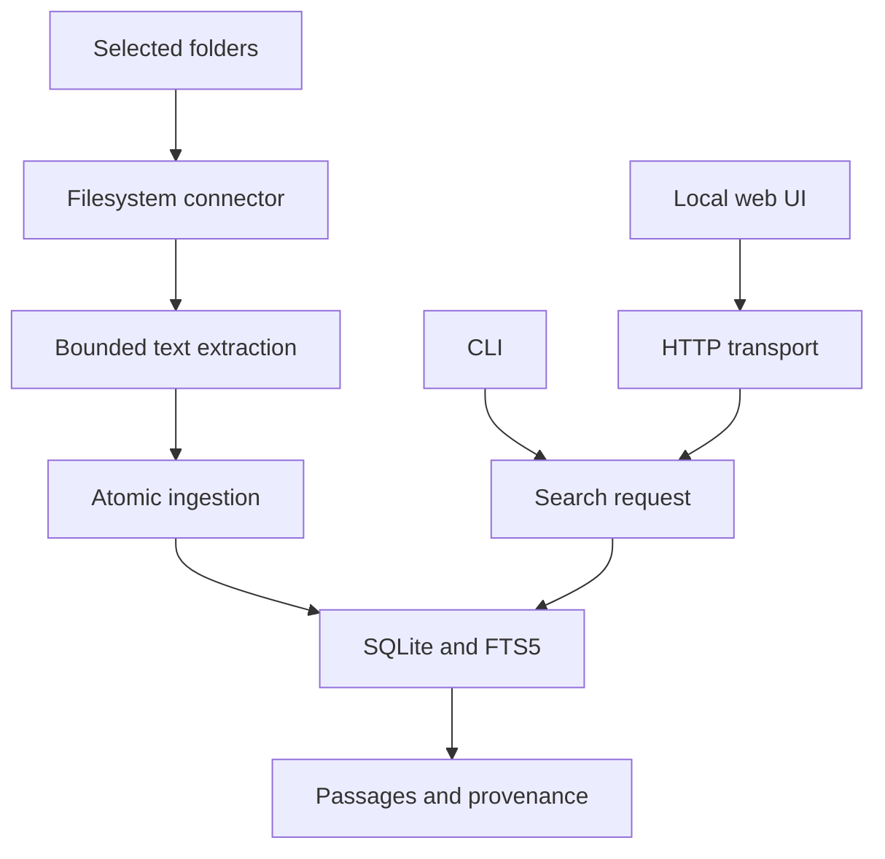

# Architecture

## Shape

Findrail starts as a modular Go application with an embedded SQLite index and
local clients. The modular boundaries are designed for a large product without
requiring separate services to run the first useful workflow.

This diagram describes the implemented path. Cloud adapters, watching, semantic
retrieval, desktop launching, and MCP are future extensions.

## Boundaries

| Module | Owns | Depends on |
|---|---|---|
| `pkg/connector` | Source / document inventory contract | Go standard library |
| `internal/connectors/filesystem` | Explicit root enumeration and source identity | Connector contract, text extraction |
| `internal/extract/text` | Bounded reads and UTF-8 validation | Standard library |
| `internal/ingest` | Atomic full-source scan orchestration | Connector contract, storage interface |
| `internal/store/sqlite` | Schema, transactions, content hashes, FTS, sources | SQLite driver and domain contracts |
| `internal/search` | Retrieval request / response and literal query handling | Standard library |
| `internal/transport/http` | Loopback HTTP and embedded browser UI | Search interface, source status model |
| `internal/cli` | Composition, command parsing, presentation | Application modules |
| `cmd/findrail` | Process entry, signals, version | CLI |

The first transport source-status interface uses the SQLite source-status type;
move that DTO into a neutral package when a second storage adapter is justified.
Do not create a second persistence abstraction solely to hide this small seam.

## Ingestion transaction

1. Resolve and validate the selected source; generate a stable source ID.
2. Start a storage transaction and a unique scan token.
3. Enumerate documents under the source root. Extract bounded text, hash it,
   attach original URI and path, and emit normalized documents.
4. Insert new / changed documents. Unchanged text updates scan metadata without
   rewriting the FTS index.
5. After a successful complete enumeration, prune source documents not seen in
   the scan, update freshness, and commit.
6. On any enumeration / extraction / storage error or cancellation, roll back.

Every source is independent. Overlapping roots can intentionally create distinct
source entries; cross-source deduplication is a later retrieval feature.

## Identity and deletion

The filesystem source ID hashes the canonical absolute root. Document IDs hash
source ID and normalized relative path. A rename therefore creates a new document
and removes the old one after a complete scan. Content hashes detect unchanged
extracted text. Original files are never modified.

Deletion triggers update FTS in the same transaction. `forget` logically removes
a source, documents, and searchable terms. SQLite / WAL / filesystem bytes may
remain recoverable; logical deletion is not a cryptographic erasure claim.

## Retrieval

The foundation tokenizes user input into quoted literal FTS terms joined with
AND. SQL parameters carry all user values. BM25 ranks titles and content with a
higher title weight. Responses contain a bounded excerpt, source, original URI,
relative path, total count, and stable ID.

Future search will add passage chunks, structured filters, deduplication, language
analysis, and optional semantic candidates. Store a chunk-to-document mapping and
content hash for citations; stale embeddings must never survive a document update
or source removal.

## Storage

SQLite FTS5 and a CGO-free Go driver keep installation simple. WAL and foreign
keys are enabled. Schema migration 1 is transactional and embedded in the binary.
Unknown newer schemas are rejected. The foundation uses one DB connection,
serializing operations; production background sync will need a single writer
queue with separately configured read connections and concurrency measurements.

Content is stored locally as plaintext. The default directory is private when
newly created; existing directory permissions are not rewritten. Disk encryption
remains the user's operating-system responsibility until a separately designed
encrypted storage mode exists.

## Source sandbox

Folder roots are explicitly chosen. Symlinks and hidden entries are skipped.
`os.OpenRoot` confines file opening to the chosen root. Size and UTF-8 limits apply
before indexing. Source code and HTML are treated as text. Known credential-like
filenames are filtered, but arbitrary embedded secrets cannot be reliably
recognized by this baseline policy.

## Transports and clients

The current server binds only to a loopback address. Host and Origin checks limit
browser-origin access, and no arbitrary filesystem-reading or mutation endpoint
is exposed. Indexed text enters the UI through `textContent`, not HTML insertion.
These boundaries do not protect against a compromised OS account or local malware.

Remote serving requires an explicit authentication design, authorization, TLS,
and operational documentation. Changing the default bind address is not that
design. MCP will initially expose read-only search and evidence retrieval, with
source scopes and bounded responses.

## Growth path

| Milestone | Additions |
|---|---|
| Local alpha | PDF text, file watching, evidence preview, query evaluation corpus |
| Connected alpha | GitHub adapter, credential vault, cursors, retry / deletion semantics |
| Extensible beta | Connector SDK stabilization, versioned manifests, conformance suite |
| Semantic beta | Optional embedding worker, passage retrieval, hybrid evaluation |
| Clients | Desktop launcher, read-only MCP, editor / browser integrations |
| Larger deployments | Separate read pools; operated sync / storage only after demand |

The application becomes a service platform only if user needs and measurements
justify it. The default local product stays independently usable.

## References

- [Go module organization](https://go.dev/doc/modules/layout)
- [Project layout conventions](https://github.com/golang-standards/project-layout)
- [SQLite FTS5](https://www.sqlite.org/fts5.html)
- [modernc SQLite driver](https://pkg.go.dev/modernc.org/sqlite)
